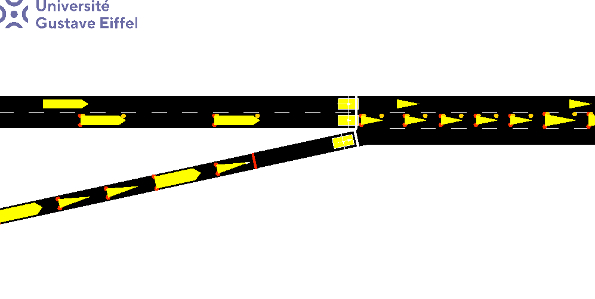
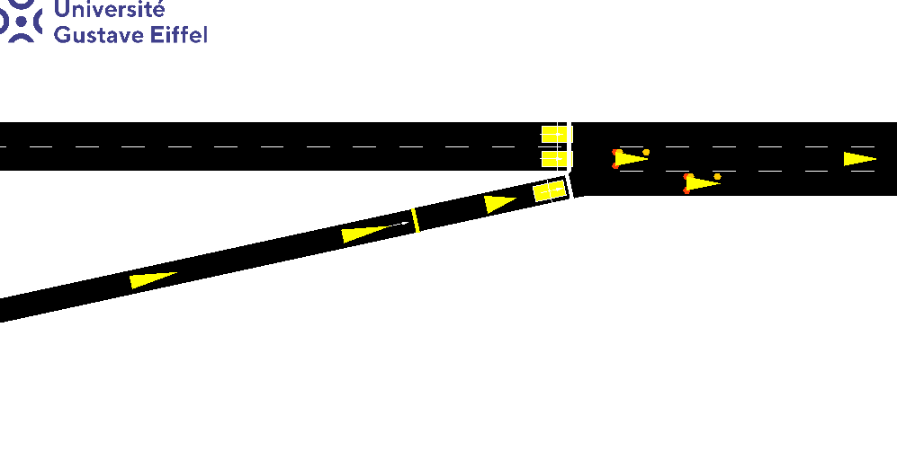

# D-DOC: DDPG-based Reinforcement Learning for Highway Ramp-Metering Control under Delayed Observations and Continuous-action Space

Cong-Son DUONG, Mohammed Adel Djelloul ABBOU, Francky RASATAHARISOA, Nikethan NIMALAKUMARAN, Lucas UCKERMANN

**Supervisor:** Nadir FARHI, HDR, Researcher

**Report:**  [Final Report](https://heyzine.com/flip-book/f64df9886d.html)
<iframe allowfullscreen="" scrolling="no" class="fp-iframe" style="border: 1px solid lightgray; width: 100%; height: 400px;" src="https://heyzine.com/flip-book/f64df9886d.html"></iframe>

**Source Code:**  [Source Code](https://github.com/CongSon01/RL_Ramp)

**Demo:** 

<div style="display: flex; justify-content: space-between;">
  <div style="text-align: center;">
    
    <p>Fixed-Control</p>
  </div>
  <div style="text-align: center;">
    
    <p>D-DOC</p>
  </div>
</div>

## Introduction

Ramp metering is an effective strategy to reduce traffic congestion by controlling the rate
of vehicles entering the highway. However, practical ramp-metering systems often face challenges such as delayed sensor data and the need for continuous control signals. To address these challenges, we propose **D-DOC**, a DDPG-based Reinforcement Learning framework specifically designed for ramp metering control in both delayed state information and continuous action spaces. Leveraging Deep Deterministic Policy Gradient, our approach adaptively learns optimal metering rates that minimize congestion on the ramp and maximize traffic flow on the highway.

We have implemented the proposed method in the SUMO simulation environment and evaluated performance across two contrasting scenarios: (1) a constant scenario with static flows, and (2) a dynamic scenario exhibiting peak hours from 8:15 to 8:45. Comparisons are made against a Fixed-Control approach (fixed or pre-timed signals) as well as RL (Reinforcement Learning) methods with decision-making strategies (e.g., E-Greedy, Double-DQN). Our results show that D-DOC effectively manages ramp inflows despite observation delays, maintaining higher flow rates, reducing congestion, and improving overall travel conditions. This study thus demonstrates the practicality and benefits of a DDPG-driven policy for real-time ramp metering under uncertain and continuous-control requirements.

## Simulation in SUMO

This project uses the **SUMO** (Simulation of Urban MObility) environment to simulate traffic scenarios and evaluate the performance of the D-DOC framework. The simulation includes two main scenarios:

1. **Constant Flow Scenario**: Traffic flows are static, representing a typical non-peak scenario.
2. **Peak Hours Scenario**: A dynamic scenario from 8:15 to 8:45, where traffic flows fluctuate to simulate peak-hour congestion.

The reinforcement learning models (E-greedy, DQN, and DDPG) are trained and tested in these scenarios to evaluate the impact of the proposed D-DOC approach under different traffic conditions.

## Code Structure

The project is structured into the following files:

### Training Files

- [**EGreedyAgent.py**](./EGreedyAgent.py): Contains the implementation for training the **E-greedy** reinforcement learning model.
- [**DQNAgent.py**](./DQNAgent.py): Contains the implementation for training the **DQN (Deep Q-Network)** model.
- [**DDPGAgent.py**](./DDPGAgent.py): Contains the implementation for training the **DDPG (Deep Deterministic Policy Gradient)** model.

### Testing Files

- [**test_normal.py**](./test_normal.py): A script to test the **normal scenario** with static flows (constant traffic).
- [**test_peak.py**](./test_peak.py): A script to test the system under **peak hour** traffic conditions (8:15–8:45).
- [**test_delayed_observation.py**](./test_delayed_observation.py): A script to test the impact of **delayed observations** on the ramp-metering control.
- Adjust the `delay_probability` variable to increase the number of vehicles experiencing delayed information.

> **Note:**  
> In all testing scripts, you can set the `use_model` variable to `False` to experiment with the **Fixed-Control** scenario. In this case, traffic lights are switched at fixed intervals of 30 seconds.

## Setup and Installation

To run the simulation and train the models, follow these steps:

### Requirements:

- **Python 3.9+**
- **SUMO** (Simulation of Urban MObility)
- **TensorFlow** (for DQN and DDPG implementations)
- **PyTorch** (for DDPG implementation)
- **NumPy** and **Matplotlib** (for numerical and graphical operations)

### Installation:

1. Install **SUMO**: Follow the [SUMO installation guide](https://sumo.dlr.de/docs/Installing/index.html) for your platform.
2. Clone the repository:
   ```bash
   git clone https://github.com/CongSon01/UGE-RL_Ramp.git
   cd UGE-RL_Ramp
   ```
3. Create a Conda Environment:
  ```bash
  conda create --name RL_ramp python=3.10 -y
  conda activate RL_ramp
  ```

4. Install Dependencies:

   ```bash
   pip install -r requirements.txt
   ```

5. Run the Simulation:

   ```bash
   python test_delayed_observation.py
   ```
